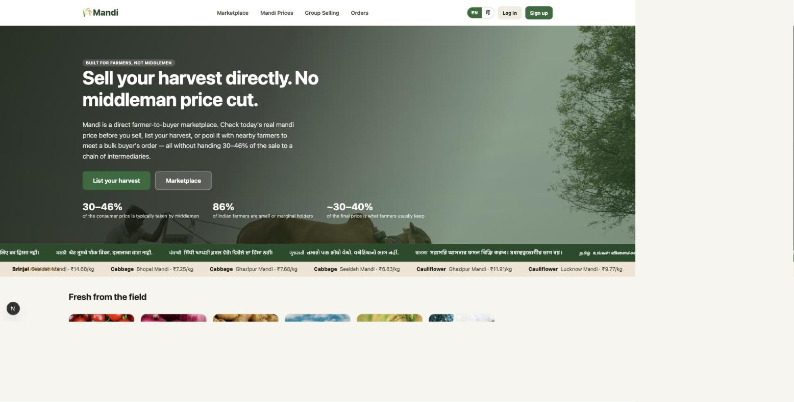
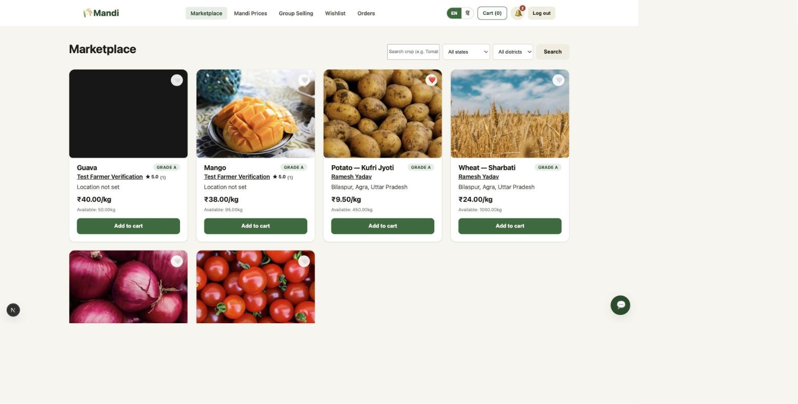
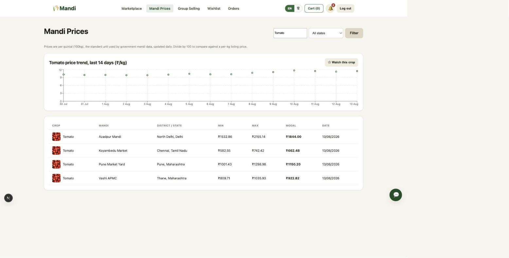
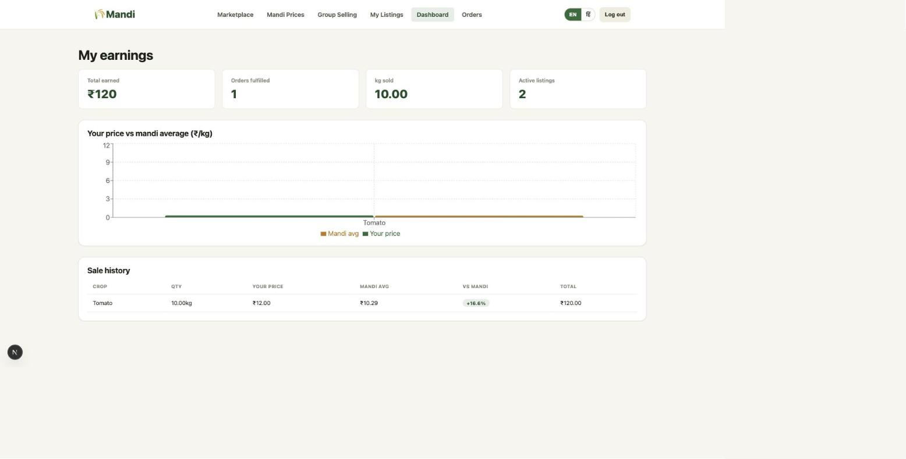
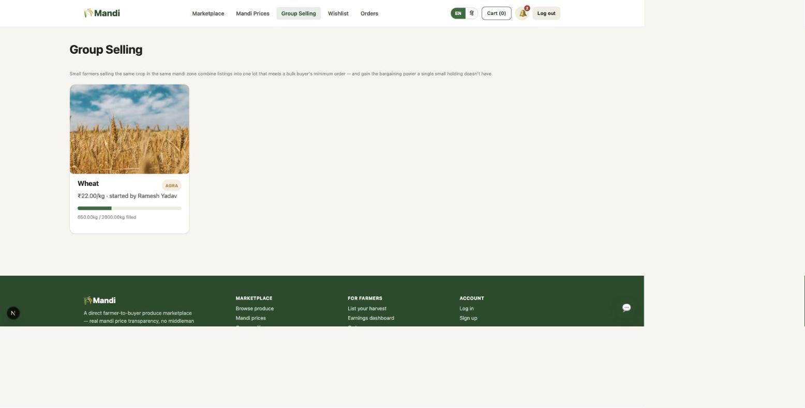
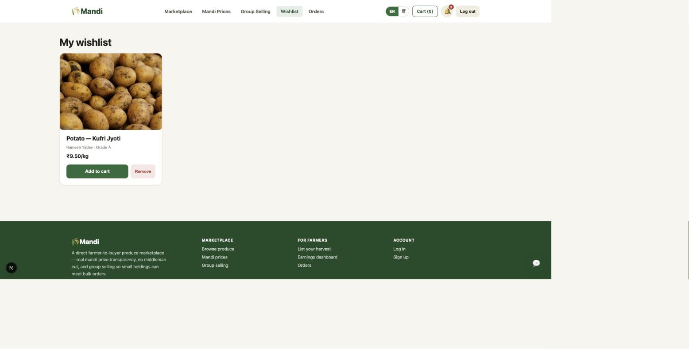
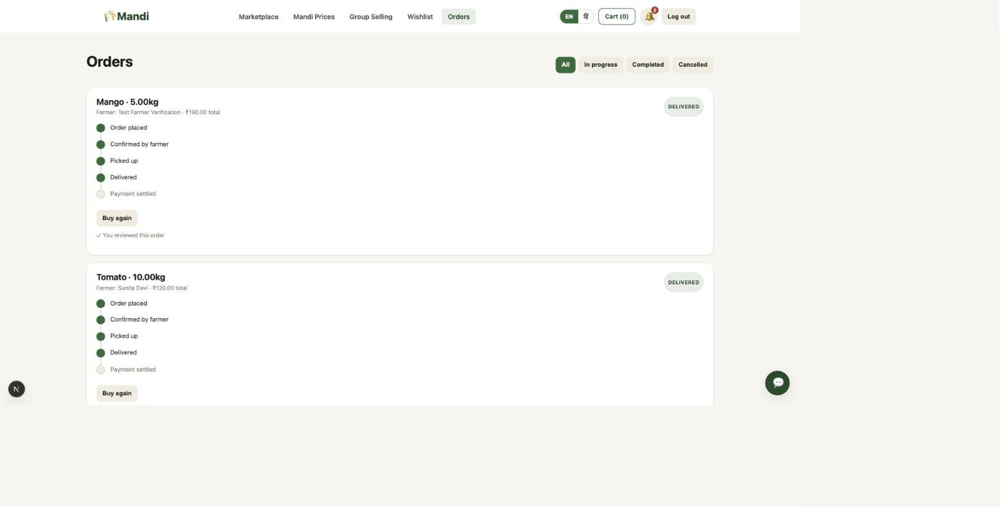
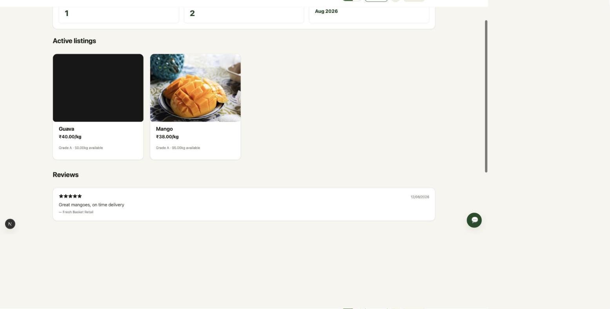
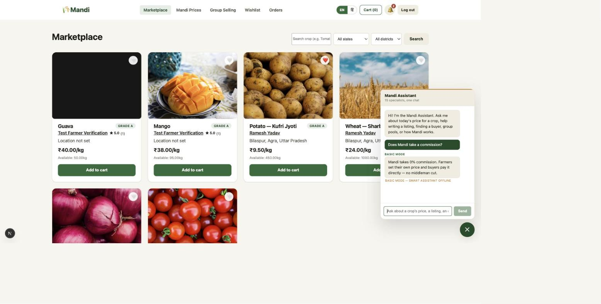

# Mandi

A direct farmer-to-buyer produce marketplace built to cut out commission middlemen. See
[PROBLEM.md](./PROBLEM.md) for the problem statement, sources, and full product/architecture plan.

Built to close a specific gap: existing digital mandis (eNAM, Ninjacart, DeHaat) mostly
serve bulk B2B supply chains or urban consumers and leave small/marginal farmers — 86% of
India's farming population — without price visibility or bargaining power. Mandi gives a
farmer a price board before they sell, direct listings with no commission layer, group
pooling for bulk orders, and a dashboard that shows what they actually earned versus the
mandi average.

## Screenshots

| | |
|---|---|
|  |  |
| Landing page — multi-language slogan strip and a live mandi price ticker | Marketplace — listings with wishlist hearts, farmer ratings, and Verified badges |
|  |  |
| Mandi price board — 14-day trend chart plus a "Watch this crop" price alert | Farmer dashboard — your price vs. that day's mandi average, CSV export |
|  |  |
| Group Selling — farmers pooling a crop toward a bulk buyer's minimum order | Wishlist — save a listing to buy later, persists across devices |
|  |  |
| Orders — status filters, live tracking timeline, one-click "Buy again" | Farmer public profile — rating, verified status, reviews, active listings |
|  |  |
| In-app notifications — pushed live over the existing Socket.IO connection | Mandi Assistant — the 15-agent LangGraph chat widget, shown here in no-LLM fallback mode |

## Features

**Core marketplace**
- **Direct listings** — farmer posts crop, quantity, price/kg, quality grade, and photo;
  buyers order directly, no commission layer between the two prices shown.
- **Mandi price board** — daily min/max/modal price per crop, per mandi, seeded in the
  same shape as the government's real Agmarknet dataset so a live feed is a drop-in swap
  (`npm run fetch-prices`, with or without a real `AGMARKNET_API_KEY`).
- **Group Selling (pools)** — several farmers combine listings of the same crop in the
  same mandi zone into one lot that meets a bulk buyer's minimum order.
- **Cart, checkout, and escrow-style orders** — a buyer's payment is held until they
  confirm delivery; the order pipeline (`pending → confirmed → picked up → delivered →
  paid_out`) is tracked live over Socket.IO on both sides.
- **English/Hindi toggle**, plus a decorative multi-language slogan marquee (8 Indian
  languages) and a live mandi-price ticker on the landing page.
- **Curated crop photography** everywhere a listing shows up, with a graceful emoji
  fallback if an image ever fails to load.

Beyond that core flow, these address specific gaps from the problem statement:

**Trust, since there's no commission agent to vouch for anyone anymore**
- **Ratings** — buyers rate farmers 1–5 stars after delivery; the average shows on every
  listing.
- **Verified Farmer badge** — computed automatically from delivery history (3+ completed
  orders), not self-declared, so it can't be gamed by a new account.
- **Farmer public profiles** — a buyer can click through from any listing to a farmer's
  full track record: rating, completed orders, every review left, and everything else
  they currently have for sale.

**Staying informed without checking the app all day**
- **In-app notifications** — a farmer gets pinged the moment a buyer orders, when a pool
  they've joined fills, or when a review comes in; a buyer gets pinged as their order
  moves through pickup and delivery. Pushed live over the existing Socket.IO connection.
- **Price watchlist & alerts** — watch a crop from the price board and get notified when
  its mandi price moves sharply (≥8% day-over-day), instead of re-checking every morning.
- **Price trend chart** — the last 14 days for a crop, not just today's snapshot, so a
  price spike or crash is visible before it's reflected in a single day's number.

**Finding and buying the right thing**
- **Location filters** — state/district dropdowns on the marketplace and price board,
  populated from real listing data rather than a hardcoded list.
- **Wishlist** — save a listing to buy later instead of losing it once you've navigated
  away.
- **Buy again** — reorder from a past delivered order in one click; checks the listing is
  still active and has stock before adding it to cart, rather than assuming it does.
- **Order status filters** — split an order history into in-progress / completed /
  cancelled once it's long enough that scrolling through everything stops being useful.

**Farmer tools**
- **Real harvest photos** — farmers can attach an actual photo of their produce (resized
  and compressed client-side, no object storage needed) instead of relying only on the
  representative stock photo.
- **Earnings export** — a farmer's sale history exports to CSV for their own records.

## Mandi Assistant — a 15-agent LangGraph system

A chat widget (bottom-right, every page) backed by a real `StateGraph`, not a single
mega-prompt pretending to be many agents. A **supervisor node** classifies each message
via structured output and routes it — one conditional edge per specialist — to exactly
one of 15 specialist nodes:

| Trust & discovery | Staying informed | Buyer/farmer help |
|---|---|---|
| Trust Summarizer | Price Advisor | Buyer Matchmaker |
| Fraud Watchdog | Market Analyst | Listing Writer |
| Onboarding Guide | Order Status Assistant | Quality Grader |
| FAQ Support | | Pool Advisor |
| | | Negotiation Coach |
| | | Translator |
| | | Logistics Planner |
| | | Complaint Handler |

7 of the 15 are grounded in real DB-backed tools (`get_mandi_price`, `search_listings`,
`get_open_pools`, `get_order_status`, `get_price_trend`, `get_farmer_reviews`) — a
specialist never invents a price or an order status, it looks one up. `get_order_status`
closes over the requester's identity server-side rather than trusting an LLM-supplied
user ID, the same pattern the tool factory in the sibling Restaurant project uses.

No `ANTHROPIC_API_KEY`, or the API call fails for any reason (rate limit, timeout, bad
key)? The whole thing degrades to a no-LLM fallback — a real DB price lookup if the
message names a known crop, then a keyword-matched FAQ, then a generic pointer to the
right page. The chat widget shows a "Basic mode" tag whenever an answer came from there
instead of Claude, so degradation is visible, not silent.

```
backend/src/agents/
├── tools.ts        6 DB-backed LangChain tools, built per-request so a user's identity
│                   is closed over rather than trusted as an LLM argument
├── specialists.ts  the 15 specialist configs — system prompt + which tools each gets
└── mandiGraph.ts   the StateGraph: supervisor (structured-output routing) + 15
                    specialist nodes, each a small ReAct agent, all → END
```

## Stack

- **Backend:** Express + TypeScript, PostgreSQL, JWT auth, Socket.IO (live order status),
  LangGraph + LangChain + Claude (Mandi Assistant)
- **Frontend:** Next.js (App Router, TypeScript), Recharts, English/Hindi label toggle,
  curated crop photography

## Run locally

```bash
cp .env.example .env
docker compose up -d postgres
cd backend && npm install && npm run dev      # http://localhost:4000
cd frontend && npm install && npm run dev     # http://localhost:3000
```

A fresh database gets the full schema from `backend/src/db/init.sql` automatically. If
you're upgrading an existing database, apply any migrations added since (`backend/src/db/migrations/`)
once:

```bash
cd backend && npm run migrate
```

Seed demo accounts and sample listings (run once, after the backend is up):

```bash
cd backend && npm run seed
```

Load a fuller mandi price board — 18 crops × 17 mandis across India, three weeks of
daily history:

```bash
cd backend && npm run fetch-prices
```

With `AGMARKNET_API_KEY` set in `.env` (get one at
[data.gov.in/user/register](https://data.gov.in/user/register)), this pulls live prices
from the government's actual Agmarknet feed. Without a key it falls back to a
realistically-shaped synthetic dataset — same schema either way, so the rest of the app
doesn't care which source populated it.

Set `ANTHROPIC_API_KEY` in `.env` (get one at [console.anthropic.com](https://console.anthropic.com))
to turn on the Mandi Assistant chat widget. Without it, the widget still works — it just
answers in no-LLM fallback mode instead of routing through the 15-agent graph.

Demo logins (password `password123`):

| Role   | Phone      |
|--------|------------|
| Farmer | 9800000001 |
| Farmer | 9800000002 |
| Buyer  | 9800000003 |

Or run everything in Docker: `docker compose up`.

## Project layout

```
backend/   Express API — auth, listings, mandi-prices, pools, orders, farmer dashboard
frontend/  Next.js app — marketplace, listing management, price board, pools,
           cart/checkout, order tracking, farmer dashboard
```
